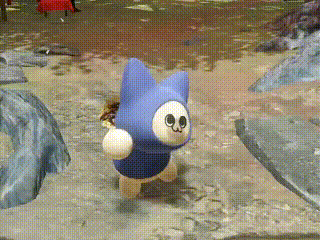
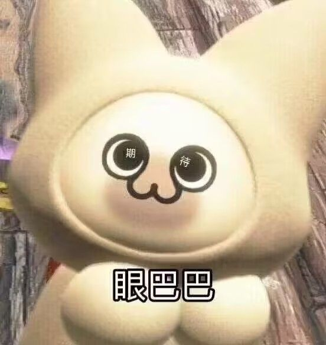

<!-- 可爱的封面 -->

  

<h1 align="center">✧从0开始的AI之旅✧  ~ 2025萌版指引 ~</h1>

<em>(喵~欢迎你，勇敢的冒险者！这里是AI世界的起点！)</em>

---

## 🧭 预备知识（先修任务）

- 🛰️ 科学上网指南：[Clash Verge 传送门](https://clash.top/clash-verge/)
- ❓ 提问的智慧：[How To Ask Questions The Smart Way](https://github.com/ryanhanwu/How-To-Ask-Questions-The-Smart-Way/blob/main/README-zh_CN.md)

> (*ゝω・)请在学习过程中多多提问！在群里勇敢发言，或召唤 ChatGPT（推荐 GPT-4o 和 Claude 3.5 Sonnet）也是完全OK的！

---

## 🧪 环境配置

> 点击以下任意链接，进入梦幻般的 AI 世界构建传送阵！

- [CSDN 教程](https://blog.csdn.net/qq_43874102/article/details/123164105)
- [B站视频教程](https://www.bilibili.com/video/BV1Fo46e3EAZ/?spm_id_from=333.337.search-card.all.click&vd_source=e93406706d42cbeffbe98257dede7f44)

---

## 🌱 学习路线（技能树分支）

### 一. 如果你是**萌新喵喵**（没学过 Python）：
🔗 [点我开始你的Python入门冒险](https://www.bilibili.com/video/BV1qW4y1a7fU?spm_id_from=333.788.recommend_more_video.0&vd_source=e93406706d42cbeffbe98257dede7f44)（完成前9章即可~）

---

### 二. 没学过高数/线代/概率论的同学：
🧠 建议学到：
- 吴恩达深度学习课程中的「第二课-3.10 深度学习框架」部分  
🔗 [B站传送门](https://www.bilibili.com/video/BV16r4y1Y7jv/?vd_source=e93406706d42cbeffbe98257dede7f44)

这一步的理论内容 ≈ [动手学深度学习](https://zh.d2l.ai/chapter_attention-mechanisms/index.html)的第 3-4 章

---

### 三. 数学底子不错 or 想更快成长的小伙伴：
📘 主攻 [动手学深度学习](https://zh.d2l.ai/chapter_attention-mechanisms/index.html) 的前 10 章！  
推荐理由：使用 PyTorch，跟学术界接轨！

---

### 四（选修支线任务）. 具身智能方向（偏科研&论文导向）：
🦾 需要掌握强化学习基础  
🔗 [强化学习课推荐](https://www.icourse163.org/course/XHUN-1470436188)  
💌 有兴趣请联系学长 QQ：787471313

---

## 📅 面试时间

> 🕐 待定（你可以先悄悄练习~(〃∀〃)）

---

## ✍️ 面试内容

1. ✨ 复现 MNIST 手写数字识别（Pytorch 优先！）
2. 💪 预训练模型微调（加分项）：ViT 架构  
   - 参考：[Google ViT项目](https://github.com/google-research/vision_transformer)  
   - 可选数据集：
     - CIFAR-100：包含100类图像，每类600张；
     - Caltech256：[点我下载](https://link.zhihu.com/?target=http%3A//www.vision.caltech.edu/Image_Datasets/Caltech256/)
3. 🤖 具身智能方向（待定中~）
4. ❓ 针对基础知识 & 代码的 Q&A 小测试！

---

## 🎁 你将获得什么？

1. 🏆 参与百度飞桨 AI 赛事、项目、开源实习机会！
2. 📚 打下 AI 基础，为后续校内/省级/国家级比赛蓄力！
3. 🧪 有机会参与实验室的科研项目 & 论文产出！
4. 🏢 免费使用科技楼九楼的六个工位！（摸鱼也没人管你～）

---

## ✨ 最后的话

> “让我们一起踏上成为 AI 魔法师的旅程吧！”  
> ✨ヾ(｡･ω･｡) — 本指南由AI萌化协会友情赞助！

---

  

